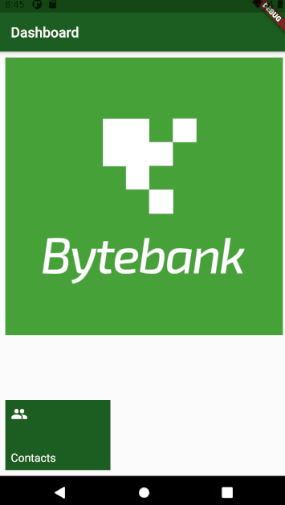

# alura_bytebank_sqflite

Um projeto desenvolvido com Flutter com apoio da tutoria da Alura.
Este projeto tem como finalidade aprender a funcionalidade de armazenar informações com persistência no banco de dados SQLite.

## Demonstrativo:

## Curso:

Finalizado o curso [Persistência com Flutter: Crie um app com armazenamento interno](https://cursos.alura.com.br/course/flutter-persistencia-interna).

Certificado: https://cursos.alura.com.br/certificate/a0b0533f-2ba9-49f1-8af1-bcfe9077ad02
